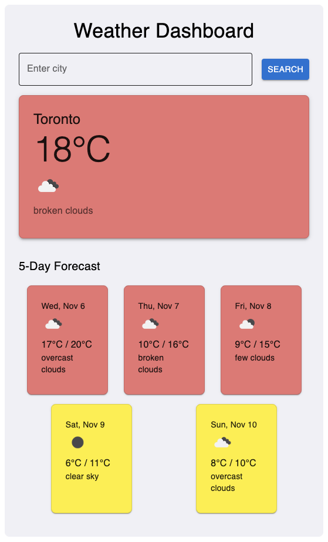

# Weather Dashboard 🌤️

This Weather Dashboard is a React application that allows users to search for the weather forecast of a city and displays both the current weather and a 5-day forecast. The app uses the OpenWeather API to fetch weather data and supports temperature-based dynamic styling for a visually engaging experience.

 <!-- Add a screenshot of the app here for visual appeal -->

## Features
- **Current Weather**: Displays the current temperature, weather condition, and an icon representing the weather.
- **5-Day Forecast**: Shows daily temperature forecasts with color-coded cards based on the temperature.
- **Persistent Last Searched City**: Saves the last searched city to local storage, auto-populating weather data on app reload.
- **Responsive Design**: Optimized for both mobile and desktop views, utilizing Material UI components and a mobile-first approach.

## Technologies Used
- **React**: Front-end JavaScript library for building user interfaces.
- **TypeScript**: Adds type safety to the JavaScript code.
- **Material UI**: Provides pre-styled components for a sleek and responsive UI.
- **OpenWeather API**: Fetches real-time weather data.
- **Local Storage**: Stores the last searched city to enhance the user experience.

## Getting Started

### Prerequisites
- **Node.js** (v14 or higher recommended)
- **npm** or **yarn** for managing packages

### Installation

1. **Clone the repository:**
   ```bash
   git clone https://github.com/volkanb/weather-dashboard.git
   cd weather-dashboard
   ```

2. **Install dependencies:**
   ```bash
   npm install
   ```
3. **Set up OpenWeather API Key:**
   - Create an account on [OpenWeather](https://openweathermap.org/) and get an API key.
   - Add your API key to the `.env` file.
   ```
   REACT_APP_WEATHER_API_KEY=your_api_key_here
   ```
4. **Start the development server:**
   ```bash
   npm start
   ```
   The app will be available at `http://localhost:3000`.

## Folder Structure
- `src/`: Contains the main application code.
  - `components/`: React components for the UI.
  - `services/`: Functions for fetching weather data.
  - `utils/`: Utility functions and constants.
  - `App.tsx`: Main application component.
  - `index.tsx`: Entry point for the React application.

## Usage
1. **Search for a city**: Enter the name of a city in the search bar and press Enter or click the search button.
2. **View current weather**: The app will display the current temperature, weather condition, and an icon representing the weather.
3. **View 5-day forecast**: The app will display a 5-day forecast with temperature forecasts and weather conditions.
4. **Persistent last searched city**: The last searched city will be saved to local storage and auto-populated on app reload.

## License
This project is licensed under the MIT License - see the [LICENSE](LICENSE) file for details.


Happy coding! ✨